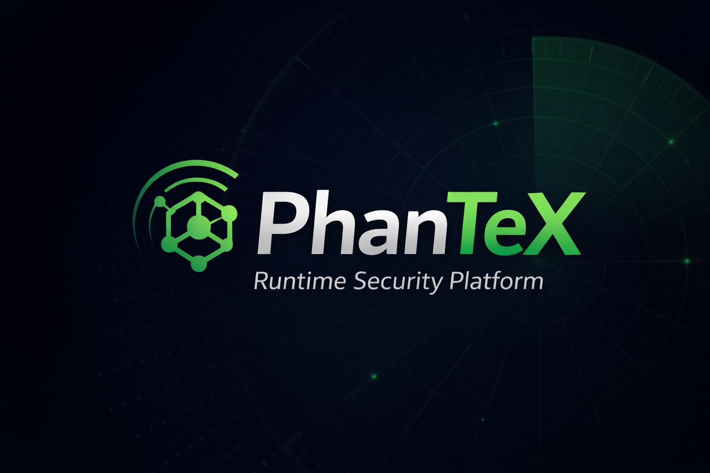

<p align="center">
  
</p>

<p align="center">
  <em>"See the Invisible. Stop the Inevitable."</em>
</p>

<p align="center">
  <a href="LICENSE"></a>
  <a href="https://github.com/AKiileX/Phantex/actions/workflows/ci.yml"></a>
  <a href="https://github.com/AKiileX/Phantex/actions/workflows/formal-verify.yml"></a>
  <a href="https://github.com/AKiileX/Phantex/releases"></a>
  
  
</p>

> **Beta Release** — PhanTeX is under active development. Core functionality is working and tested, but you should expect rough edges, incomplete coverage on some platforms, and breaking changes between releases. Production deployments should be evaluated carefully. Bug reports and contributions are welcome.

---

PhanTeX is a runtime security platform purpose-built for AI agents, MCP servers, tool-using LLM systems, and inter-agent workflows. It gives security, platform, and compliance teams full visibility into what agents are doing — detects unsafe behavior in real time, enforces policy at the runtime layer, automates response, and produces tamper-evident audit evidence that holds up under regulatory scrutiny.

Instead of treating agents like opaque applications, PhanTeX models them as active runtime identities with tools, permissions, communication paths, trust relationships, cost footprints, and compliance obligations. The platform combines deep telemetry, deterministic and ML-powered detection, investigation tooling, and automated enforcement so teams can operate agentic systems with the same rigor they expect for endpoints, cloud workloads, and identities.

> **Self-hostable. Cloud, on-prem, and air-gapped. Apache 2.0.**

---

## Platform At A Glance

| Metric | Detail |
|--------|--------|
| **Dashboard** | 57 operator views — investigation, intelligence, compliance, analytics, response, sensor fleet, admin — each with built-in guides |
| **API surface** | 330+ endpoints across REST, GraphQL, and WebSocket (45 routers) |
| **Detection engine** | PRL rule engine + 3-stage ML ensemble + content analysis (sub-20 ms) |
| **Attack coverage** | 14 attack classes with built-in red-team simulation |
| **SDKs** | Python, Node.js, Go, .NET, Java, Ruby |
| **Auth** | JWT RS256 via Vault Transit, SAML 2.0, OIDC with PKCE, SCIM 2.0 |
| **Data stores** | Postgres 16 (RLS + pgcrypto), ClickHouse 24, Neo4j 5, Redis 7, Kafka 3.7 (KRaft) |
| **Secrets** | HashiCorp Vault — Transit + KV v2 + AppRole + per-service ACL |
| **TLS** | mTLS everywhere, TLS 1.3 minimum, ECDSA P-256, 24h leaf cert TTL, hot-reload |
| **Languages** | Python · TypeScript · Go · Rust · C |
| **Deployment** | Docker Compose, Kubernetes + Helm, on-prem binary, air-gapped packaging |
| **Upgrade** | Automated rollout with pre-flight checks, backup, health gate, auto-rollback |
| **Supply chain** | SBOM (SPDX), cosign image signing, Trivy scanning, SRI, SHA-pinned CI |
| **IaC** | Terraform provider — 5 resources, 2 data sources, scoped API key auth |

---

## Built For

- **Security teams** that need to catch rogue AI behavior before it becomes data loss, lateral movement, or policy drift
- **Platform teams** that need one control plane for agents, MCP servers, local runtimes, and API-based LLM apps
- **AI engineering teams** that need runtime visibility without drowning in false positives
- **Compliance and audit teams** that need policy enforcement, tamper-evident evidence, and investigation trails

---

## Quick Start

```bash
git clone https://github.com/AKiileX/Phantex.git
cd Phantex
./quickstart.sh            # ~8 GB RAM — builds, migrates, starts everything
```

Open **http://localhost:3000** — login with `admin@phantex.dev` / `changeme`.

| Mode | RAM | Command |
|------|-----|---------|
| **Lite** (no ML/analytics) | ~2 GB | `./quickstart.sh --lite` |
| **Lite + ML** | ~3.5 GB | `./quickstart.sh --lite-ml` |
| **Full** (all services) | ~8 GB | `./quickstart.sh` |
| **Production** (hardened) | ~8 GB | `./quickstart.sh --prod` |

All modes run the full event pipeline: sensors → gateway → Kafka → rules → alerts → dashboard. Upgrade anytime — data carries over.

---

## Why PhanTeX

**Agents are running in production. Most teams have no visibility into what they’re doing.**

PhanTeX exists because AI agents are runtime actors — they call tools, move data, talk to other agents, and make decisions — and the security tooling built for static software doesn’t cover that. PhanTeX was built from day one to solve the problems that appear once agents are actually deployed: drift, abuse, exfiltration, prompt injection, privilege escalation, supply-chain compromise through MCP servers, and the compliance gaps that come with autonomous systems.

**What teams get:**

- **Real-time agent observability** — 57 dashboard views including live topology maps, trust graphs, behavior radar, agent vitals, drift tracking, blast radius simulation, sensor fleet management, and streaming event feeds so you see exactly what every agent is doing right now.
- **Detection that covers AI-native threats** — prompt injection, jailbreak, tool abuse, MCP supply-chain risks, agent-to-agent protocol abuse, data exfiltration, and 8 more attack classes with both deterministic rules and ML-powered analysis.
- **Security infrastructure, not bolt-on config** — mTLS on every connection (TLS 1.3, ECDSA P-256), Vault-managed secrets with per-service ACLs, database-level encryption (pgcrypto), data checksums, row-level security with a dedicated app role that has no DROP/ALTER/DELETE, and AES-256-GCM encrypted trust graph snapshots.
- **Enterprise access control** — multi-tenant isolation backed by PostgreSQL Row-Level Security (not logical scoping), SAML 2.0, OIDC with PKCE, SCIM provisioning, RBAC + ABAC with 48 granular permissions, account lockout protection, and scope-based API key authorization.
- **Automated response without building a control plane** — kill switch, shadow mode, escalation ladders, SOAR integration (Phantom, Tines, XSOAR), alert routing with maintenance windows, and per-tenant response policies.
- **Compliance and audit evidence that holds up** — EU AI Act, NIST AI RMF, ISO 27001:2022, and FedRAMP Moderate automation, agent session recording with DVR replay, HMAC-SHA256 tamper-evident audit chains (per-tenant keys, BYOK supported), legal holds, and one-click evidence exports.
- **Hardened supply chain** — container image signing (cosign/sigstore), SBOM generation (SPDX), vulnerability scanning (Trivy + govulncheck + pip-audit + npm-audit), SRI for dashboard assets, non-root distroless containers, and SHA-pinned CI actions.
- **Formal verification** — TLA+, Alloy, and Z3 specifications that let you mathematically prove policy correctness, sandbox isolation, and trust graph invariants — not just test them.

---

## What It Detects

| # | Attack Class | # | Attack Class |
|---|-------------|---|-------------|
| 1 | Prompt Injection | 8 | Session Hijacking |
| 2 | Jailbreak | 9 | Agent Impersonation |
| 3 | Tool Abuse | 10 | Denial of Service |
| 4 | Data Exfiltration | 11 | Unauthorized Data Access |
| 5 | Privilege Escalation | 12 | Lateral Movement |
| 6 | Model Poisoning | 13 | Credential Theft |
| 7 | Supply-Chain Compromise | 14 | Configuration Tampering |

The built-in **Red Team Simulator** generates synthetic campaigns across these classes and produces scored security assessments without requiring external pentest tooling.

### Rogue Detection, Not Noise

Phantex ships with built-in allowlists so agents doing legitimate work — TLS handshakes, model downloads, API calls — never trigger false alerts. Only rogue deviations fire.

| Allowlist | Examples |
|-----------|---------|
| **Network destinations** | OpenAI, Anthropic, Ollama, HuggingFace, Azure, Bedrock, Groq, DeepSeek, PyPI, npm — 50+ domains |
| **File paths** | `/etc/ssl/certs/`, `~/.ollama/`, `~/.cache/huggingface/`, model caches, stdlib |
| **Process names** | ollama, llama-server, vllm, tritonserver, lmstudio-server, python, node |

All allowlists are **operator-extensible** via the dashboard or API — no code changes, no restarts. For per-agent tuning, use **Exemptions**, **Policies**, or **Maintenance Windows**.

---

## Architecture

```
┌──────────────────────────────────────────────────────────────────────┐
│                   Dashboard + PWA  (React 19 · TypeScript)          │
│  57 pages: investigation, intelligence, compliance, analytics,      │
│  response, trust, MCP observatory, FinOps, A2A, audit recording,   │
│  sensor fleet management                                            │
├──────────────────────────────────────────────────────────────────────┤
│           Backend Control Plane  (Python · FastAPI)                  │
│  330+ API endpoints · REST + GraphQL + WebSocket (45 routers)       │
│  Auth · Tenancy · Rules · ML · Compliance · Response · SOAR          │
├──────────────────────────────────────────────────────────────────────┤
│              Gateway + Streaming  (Go · gRPC · mTLS)                │
│  High-throughput ingestion · per-tenant Kafka topics                │
│  Per-sensor rate limiting · Kafka TLS/SASL                          │
├──────────────────────────────────────────────────────────────────────┤
│     Postgres (RLS)  │ ClickHouse (34 tables) │ Neo4j │ Redis       │
│     pgcrypto · data  │ analytics + MVs        │ graph │ cache       │
│     checksums · app  │                        │       │             │
│     role isolation   │   Kafka 3.7 (KRaft) ─ event transport        │
├──────────────────────────────────────────────────────────────────────┤
│     HashiCorp Vault  (Transit + KV v2 + AppRole + per-service ACL)  │
│     JWT signing · secret storage · PKI cert issuance                │
├──────────────────────────────────────────────────────────────────────┤
│              Trust Engine  (Rust) + Verification Layer              │
│  4-factor scoring · PageRank propagation · AES-256-GCM snapshots    │
│  TLA+ · Alloy · Z3 formal proofs                                   │
├──────────────────────────────────────────────────────────────────────┤
│           Sensors · SDKs · MCP Hooks · Agent Runtime Hooks          │
│  Linux eBPF (7 probes) · Windows ETW · macOS · framework hooks      │
│  Offline buffering · SDK Unix socket · auto agent discovery         │
└──────────────────────────────────────────────────────────────────────┘
```

**Data flow:** Sensor/SDK → gRPC → Gateway (Go) → Kafka → Rule Engine + ML → Postgres/ClickHouse → Backend API → Dashboard.

---

## Sensor vs SDK — Two Layers of Visibility

PhanTeX uses two complementary collection layers. Understanding when to use each is key:

| | **Sensor** (kernel-level) | **SDK** (application-level) |
|---|---|---|
| **What it sees** | Every syscall: process spawns, file opens, network connections, DNS queries, memory maps | Tool call names, arguments, prompts, model used, token counts, protocol (MCP/LangChain/etc.) |
| **How it works** | eBPF probes loaded into the Linux kernel — fully passive, can’t be bypassed | Library imported into your Python/Node/Go app — instruments AI framework internals |
| **Deployment** | Install binary on the host, run as root — no app changes needed | Add a package to your app’s dependencies or Dockerfile |
| **Detects** | SSRF connections, shell spawns, credential file access, data exfiltration, DNS to C2 domains | Prompt injection in tool args, MCP protocol violations, tool misuse patterns, token anomalies |
| **Requires app changes?** | **No** — works on any process, including closed-source and third-party apps | **Yes** — needs `pip install` / `npm install` + 2–3 lines of init code |

**Use sensor-only** when you can’t modify the AI application (third-party, SaaS agent, closed-source). The sensor still catches the *consequences* of any attack at the OS level.

**Use sensor + SDK** when you control the app or its Dockerfile. The SDK adds the *semantic* layer — what the LLM intended, not just what the process did. The rule engine correlates both for high-confidence alerting.

---

## Instrument Your Agent

### Option A — SDK (2 lines)

```python
from phantex_sdk import PhantexSDK
phantex = PhantexSDK(gateway_addr="localhost:50051", agent_id="my-agent")
phantex.auto_instrument()  # hooks LangChain, AutoGen, CrewAI, MCP automatically
```

### Option B — Dockerfile only (no source changes)

```dockerfile
COPY sdk/python/ /tmp/phantex-sdk/
RUN pip install /tmp/phantex-sdk/ && rm -rf /tmp/phantex-sdk/
ENV PHANTEX_AGENT_ID=my-agent PHANTEX_GATEWAY=gateway:50051 PHANTEX_AUTO_INSTRUMENT=1
```

### Option C — Sensor only (no changes at all)

```bash
sudo ./start-sensor.sh   # eBPF auto-discovers AI agents — zero code changes
```

### SDKs

| Language | Install | Framework Hooks |
|----------|---------|----------------|
| Python | `pip install ./sdk/python/` | LangChain, AutoGen, CrewAI, MCP, HTTP |
| Node.js / TypeScript | `npm install ./sdk/node/` | LangChain.js, Vercel AI SDK, OpenAI, Anthropic, MCP |
| Go | `go get github.com/AKiileX/Phantex/sdk/go` | http.RoundTripper, go-openai |
| .NET / C# | `dotnet add reference sdk/dotnet/` | Semantic Kernel, HttpClient handler |
| Java | Local Maven build from `sdk/java/` | LangChain4j, Spring AI |
| Ruby | `gem build sdk/ruby/phantex-sdk.gemspec` | ruby-openai, langchainrb |

Full setup → [docs/SDK.md](docs/SDK.md) | Sensor details → [docs/SENSOR.md](docs/SENSOR.md)

---

## CLI

```bash
phantex login                    # Authenticate
phantex agents list              # List all monitored agents
phantex agents get <id>          # Agent detail
phantex alerts list              # Query alerts
phantex alerts ack <id>          # Acknowledge alert
phantex alerts resolve <id>     # Resolve alert
phantex rules list               # List detection rules
phantex rules create -f rule.yml # Deploy a rule
phantex events list              # List recent events
phantex status                   # Platform health
```

---

## Security

- **mTLS everywhere** — TLS 1.3, ECDSA P-256, 24h Vault PKI leaf certs
- **HashiCorp Vault** — Transit engine for JWT RS256, KV v2 for secrets, AppRole auth
- **Tenant isolation** — PostgreSQL RLS, restricted `phantex_app` role (no DROP/ALTER/DELETE)
- **Hardened containers** — non-root, distroless, multi-stage builds, memory/CPU limits
- **Supply chain** — 87 SHA-pinned CI actions, SBOM (SPDX), cosign signing, Trivy scanning, SRI, eBPF probe signing (Ed25519)
- **Compliance** — EU AI Act, NIST AI RMF, ISO 27001:2022, FedRAMP Moderate, tamper-evident HMAC-SHA256 audit chains

---

## Integrations

| Category | Integrations |
|----------|-------------|
| **SOAR** | Splunk Phantom, Tines, Cortex XSOAR |
| **SIEM** | Splunk, Microsoft Sentinel, Elastic |
| **Notifications** | Slack, PagerDuty, Email, Webhooks |
| **Threat Intel** | STIX/TAXII 2.1, CSV, JSON, MISP |
| **IaC** | Terraform provider (5 resources, 2 data sources) |
| **Cloud** | AWS, Azure, GCP collection paths |
| **Host** | Velociraptor endpoint telemetry |

---

## Project Structure

```
backend/           Python (FastAPI) — 45 routers, rules, ML, auth, compliance
dashboard/         TypeScript (React 19) — 57-page operator console + PWA
gateway/           Go — gRPC ingestion gateway with mTLS
trust-engine/      Rust — trust scoring, PageRank, AES-256-GCM snapshots
sensor/            Go + C — eBPF / ETW sensor + agent discovery
cli/               Go — command-line interface
sdk/               Python, Node.js, Go, .NET, Java, Ruby SDKs
rules/             PRL detection rules
infra/             Helm, Vault, TLS, ClickHouse, Kafka, Neo4j configs
integrations/      Phantom, Tines, XSOAR connectors
verification/      TLA+, Alloy, Z3 formal specs
```

---

<details>
<summary><strong>Dashboard — 57 Pages</strong></summary>

**Core:** Dashboard presets · Agents grid · Agent detail · Sensors fleet · Sensor detail · Events feed · Event detail · Alerts triage · Alert detail · Rules editor

**Investigation:** Alert forensic timeline · Agent activity timeline · Attack chain (MITRE ATLAS) · Blast radius simulator · Threat replay (DVR) · ATLAS coverage matrix

**Intelligence:** Live topology (2.5D) · Hub topology · Trust graph · Behavior radar · Risk heatmap · Agent vitals · Agent drift + ABOM · MCP observatory · Threat intel (7-tab) · A2A protocol

**Analytics:** Overview KPIs · Threat landscape · Operational metrics · FinOps (token cost tracking) · Data classification

**Compliance:** EU AI Act + NIST AI RMF assessment · Audit recording (3 levels + DVR + legal holds) · Formal verification dashboard · Nerve center (pipeline monitor)

**Response:** Policies · Policy editor (Visual + YAML/Monaco) · Exemptions · Alert routing · Maintenance windows · Red team simulator

**Admin:** ML status · Auto-response (kill switch + shadow mode + escalation) · SOAR · Integrations · Deception (decoy agents + canary tokens) · Exports (OCSF/PDR) · Telemetry · SSO · Roles · Tenants · SCIM · Copilot settings · Settings hub · GraphQL explorer

**Mobile:** PWA alert triage · Offline mode

</details>

---

## Documentation

| Document | Description |
|----------|-------------|
| [Sensor Setup](docs/SENSOR.md) | eBPF/ETW sensor build, config, and deployment |
| [SDK Setup](docs/SDK.md) | All 6 SDKs — install, instrument, examples |
| [Configuration](docs/CONFIGURATION.md) | Environment variables, gateway config, ports |
| [Production](docs/PRODUCTION.md) | Secrets, hardening, Helm, air-gap, upgrades |
| [Troubleshooting](docs/TROUBLESHOOTING.md) | Common issues and fixes |
| [ML Architecture](docs/ML-ARCHITECTURE.md) | 3-stage ensemble pipeline design |
| [ML Training Guide](docs/ML-TRAINING-GUIDE.md) | Train and evaluate detection models |
| [ML Deployment](docs/ML-DEPLOYMENT.md) | Model deployment and serving |
| [Deployment Guide](docs/DEPLOYMENT-GUIDE.md) | Full deployment reference |
| [On-Prem Deployment](docs/ON-PREM-DEPLOYMENT.md) | Air-gapped and on-premises setup |
| [Formal Verification](docs/FORMAL-VERIFICATION.md) | TLA+, Alloy, Z3 specifications |
| [Dev Runbook](DEV-RUNBOOK.md) | Developer environment setup |

## Contributing

We welcome contributions. See [CONTRIBUTING.md](CONTRIBUTING.md) for development setup, coding standards, and pull request process.

## Security

Found a vulnerability? **Do not open a public issue.** See [SECURITY.md](SECURITY.md) for responsible disclosure.

## License

Apache License 2.0 — see [LICENSE](LICENSE).

---

<p align="center">
  Created by <strong>STarX</strong>
</p>
